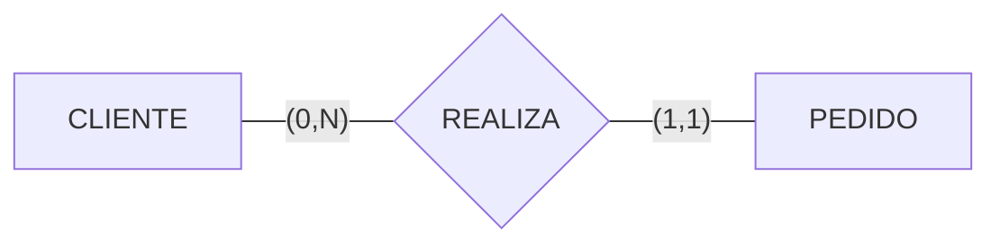
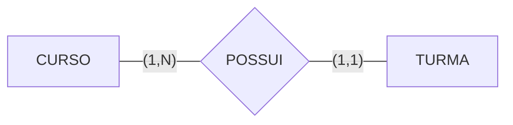
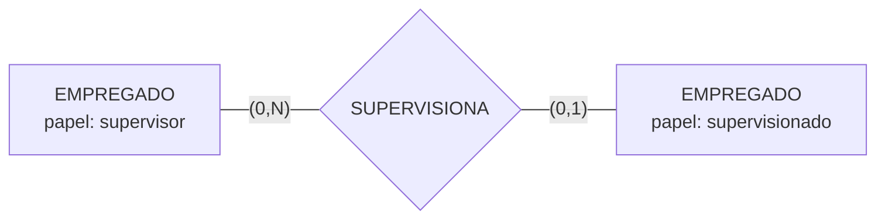
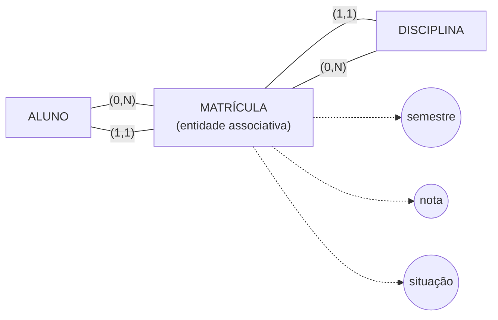
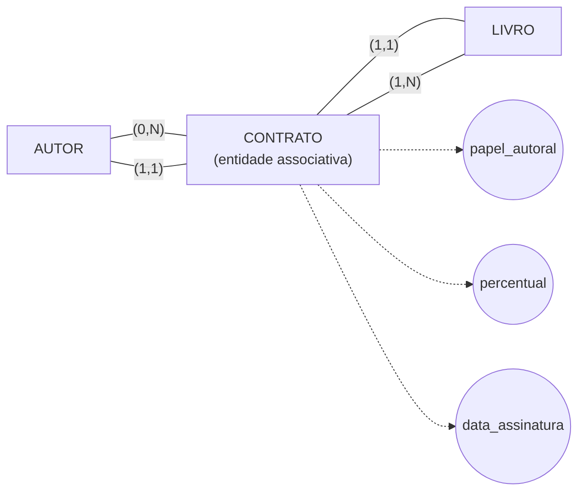

# T03 — Relacionamentos e Restrições (Banco de Dados)
### Prof. Calvetti — Exercícios de Fixação: Perguntas e Respostas

> Material baseado no slide *"Relacionamentos e restrições — Como as regras do domínio limitam as associações"*.
> Contém os 6 exercícios da seção **"5. Exercícios de fixação"**, as 2 pausas de verificação ao longo da aula e a autoavaliação final, todos resolvidos e comentados.

---

## Sumário

1. [Pausa de verificação 1 — Reconheça o tipo de relacionamento](#pausa-1)
2. [Pausa de verificação 2 — Defina mínimos e máximos](#pausa-2)
3. [Exercício • Nível 1 — Classifique os relacionamentos](#nivel-1)
4. [Exercício • Nível 2 — Leia cardinalidades em frases](#nivel-2)
5. [Exercício • Nível 3 — Extraia mínimos e máximos](#nivel-3)
6. [Exercício • Nível 4 — Modele um autorrelacionamento](#nivel-4)
7. [Exercício • Nível 5 — Crie uma entidade associativa](#nivel-5)
8. [Desafio final — Corrija um DER inadequado](#desafio-final)
9. [Autoavaliação — Recuperação ativa](#autoavaliacao)

---

## 1. Pausa de verificação — Reconheça o tipo de relacionamento

**Enunciado:** Classifique cada associação (indicando grau e natureza).

- a) ALUNO cursa DISCIPLINA.
- b) MÉDICO prescreve MEDICAMENTO a PACIENTE.
- c) FUNCIONÁRIO substitui FUNCIONÁRIO.
- d) PEDIDO contém PRODUTO e registra quantidade.

### Resposta

| Associação | Grau | Classificação | Justificativa |
|---|---|---|---|
| a) ALUNO cursa DISCIPLINA | Binário (2) | N:N | Um aluno cursa várias disciplinas; uma disciplina é cursada por vários alunos. |
| b) MÉDICO prescreve MEDICAMENTO a PACIENTE | **Ternário (3)** | Fato único e indivisível | A prescrição depende **simultaneamente** dos três participantes. Decompor em três relacionamentos binários (médico–medicamento, medicamento–paciente, médico–paciente) perderia a informação de "quem prescreveu o quê para quem". |
| c) FUNCIONÁRIO substitui FUNCIONÁRIO | Binário (2) | **Recursivo / autorrelacionamento** | O mesmo tipo de entidade participa duas vezes, em papéis diferentes (substituto / substituído). É preciso nomear os papéis para evitar ambiguidade. |
| d) PEDIDO contém PRODUTO e registra quantidade | Binário (2) | N:N **com atributo de relacionamento** | `quantidade` descreve a própria associação (varia por par pedido-produto) e não pertence isoladamente a nenhuma das duas entidades. |

---

## 2. Pausa de verificação — Defina mínimos e máximos

**Enunciado:** Modele *CLIENTE realiza PEDIDO*, sabendo que:
- Um cliente pode existir sem pedidos.
- Um cliente pode realizar muitos pedidos.
- Todo pedido pertence a um único cliente.

### Resposta

- **Leitura CLIENTE → PEDIDO:** "Um cliente pode realizar zero ou muitos pedidos."
- **Leitura PEDIDO → CLIENTE:** "Cada pedido é realizado por exatamente um cliente."
- Mínimo 0 do lado CLIENTE = participação **opcional** (cliente pode não ter pedido).
- Máximo N do lado PEDIDO (na leitura a partir de CLIENTE) = **multiplicidade** (muitos pedidos por cliente).
- Mínimo 1 e máximo 1 do lado PEDIDO = participação **total e obrigatória** (pedido não existe sem cliente).

---

## 3. Exercício • Nível 1 — Reconhecimento: Classifique os relacionamentos

**Enunciado:** Indique o grau e a natureza de cada associação.

- CLIENTE realiza PEDIDO.
- MÉDICO prescreve MEDICAMENTO para PACIENTE.
- EMPREGADO supervisiona EMPREGADO.
- ALUNO cursa DISCIPLINA com atributo nota.

> **Pista:** diferencie binário, ternário, recursivo e relacionamento com atributos.

### Resposta

| Associação | Classificação |
|---|---|
| CLIENTE realiza PEDIDO | Binário, cardinalidade **1:N** — CLIENTE (0,N) — REALIZA — PEDIDO (1,1) |
| MÉDICO prescreve MEDICAMENTO para PACIENTE | **Ternário** — um único fato de prescrição envolve os três papéis simultaneamente |
| EMPREGADO supervisiona EMPREGADO | **Recursivo (autorrelacionamento)** — mesma entidade em dois papéis (supervisor / supervisionado) |
| ALUNO cursa DISCIPLINA com atributo nota | Binário **N:N com atributo de relacionamento** (`nota` descreve o vínculo, não o aluno nem a disciplina isoladamente) |

---

## 4. Exercício • Nível 2 — Leitura: Leia cardinalidades em frases

**Enunciado:** Considere `CLIENTE (0,N) — REALIZA — PEDIDO (1,1)`.

- Escreva a leitura de CLIENTE para PEDIDO.
- Escreva a leitura de PEDIDO para CLIENTE.
- Explique o significado de 0.
- Explique o significado de N.

> **Pista:** fixe uma ocorrência antes de contar a outra.

### Resposta

- **CLIENTE → PEDIDO:** "Um CLIENTE pode realizar **zero ou muitos** PEDIDOS."
- **PEDIDO → CLIENTE:** "Cada PEDIDO é realizado por **exatamente um** CLIENTE."
- **Significado de 0** (mínimo, junto de CLIENTE): é a **cardinalidade mínima** — indica participação **opcional**; um cliente pode existir no sistema sem nunca ter realizado um pedido.
- **Significado de N** (máximo, junto de CLIENTE): é a **cardinalidade máxima** — indica **multiplicidade**; um mesmo cliente pode realizar vários pedidos ao longo do tempo, sem limite fixo.

> Regra de leitura da própria aula: *"mínimo responde 'deve participar?'; máximo responde 'quantas vezes pode participar?'."*

---

## 5. Exercício • Nível 3 — Aplicação: Extraia mínimos e máximos

**Enunciado:** *"Um curso possui uma ou mais turmas. Cada turma pertence a exatamente um curso."*

- Defina o par mín-máx de CURSO.
- Defina o par mín-máx de TURMA.
- Escreva as duas leituras.
- Indique a participação (total ou parcial) de cada lado.

> **Pista:** observe "uma ou mais" e "exatamente um".

### Resposta

- **Par mín-máx de CURSO:** `(1,N)` — mínimo 1 (obrigatório) e máximo N ("uma ou mais").
- **Par mín-máx de TURMA:** `(1,1)` — mínimo 1 e máximo 1 ("exatamente um").
- **Leitura CURSO → TURMA:** "Um curso possui uma ou mais turmas."
- **Leitura TURMA → CURSO:** "Cada turma pertence a exatamente um curso."
- **Participação:** ambos os lados têm mínimo 1, portanto a participação é **total/obrigatória dos dois lados** — não existe curso sem turma nem turma sem curso.

---

## 6. Exercício • Nível 4 — Construção: Modele um autorrelacionamento

**Enunciado:** *"Funcionários podem supervisionar outros funcionários."*

- Nomeie os dois papéis.
- Considere que um empregado pode não ter supervisor.
- Considere que um supervisor pode acompanhar vários empregados.
- Registre a proibição de auto-supervisão.

> **Restrição adicional:** como representar que um empregado não pode supervisionar a si próprio?

### Resposta

- **Papéis:** *supervisor* (lado 1) e *supervisionado* (lado 2). Os nomes de papel são obrigatórios aqui — sem eles, a linha do DER fica ambígua, pois é a mesma entidade EMPREGADO nos dois lados.
- **Cardinalidade do papel supervisionado:** `(0,1)` — um empregado pode não ter supervisor (mínimo 0) e tem, no máximo, um supervisor direto (máximo 1).
- **Cardinalidade do papel supervisor:** `(0,N)` — nem todo empregado precisa supervisionar alguém (mínimo 0), mas quem supervisiona pode acompanhar vários empregados (máximo N).
- **Proibição de auto-supervisão:** essa é uma **restrição semântica que o DER gráfico não expressa por si só** — cardinalidades e participação não impedem que o mesmo `id_empregado` apareça nos dois papéis da mesma ocorrência. Ela precisa ser **registrada textualmente como regra de negócio adicional** junto ao diagrama (por exemplo: *"id_supervisor ≠ id_empregado"*), a ser garantida depois por uma restrição CHECK no modelo relacional ou por validação na aplicação.

---

## 7. Exercício • Nível 5 — Síntese: Crie uma entidade associativa

**Enunciado:** *"ALUNO cursa DISCIPLINA; o vínculo registra semestre, nota e situação."*

- Justifique a cardinalidade N:N.
- Transforme a associação em MATRÍCULA.
- Associe os atributos à entidade correta.
- Proponha um identificador e discuta alternativas.

> **Pista:** a matrícula possui atributos e ciclo de vida próprios.

### Resposta

**Justificativa do N:N:** um aluno cursa várias disciplinas ao longo do curso e uma disciplina é cursada por muitos alunos — logo ambos os lados admitem múltiplas ocorrências simultâneas.

**Por que promover a entidade associativa?** O relacionamento N:N já carrega atributos próprios (`semestre`, `nota`, `situação`) que descrevem o vínculo, não os participantes isoladamente; além disso a matrícula tem ciclo de vida (pode mudar de situação: cursando → aprovado/reprovado). Esses são justamente os sinais que recomendam "promover" a associação a entidade.

- **ALUNO (0,N) — MATRÍCULA (1,1):** cada matrícula pertence a exatamente um aluno; um aluno pode ter zero ou muitas matrículas.
- **DISCIPLINA (0,N) — MATRÍCULA (1,1):** cada matrícula refere-se a exatamente uma disciplina; uma disciplina pode ter zero ou muitas matrículas.
- **Atributos:** `semestre`, `nota` e `situação` pertencem a **MATRÍCULA**, não a ALUNO nem a DISCIPLINA.
- **Identificador:**
  - **Alternativa 1 — composto natural:** `id_aluno + id_disciplina` — falha se o aluno puder cursar a mesma disciplina mais de uma vez (ex.: reprovação e nova tentativa), pois duplicaria a chave.
  - **Alternativa 2 — composto natural com semestre:** `id_aluno + id_disciplina + semestre` — resolve o caso de repetição em semestres diferentes, mas ainda falha se houver duas tentativas no mesmo semestre.
  - **Alternativa 3 (recomendada) — identificador substituto:** `id_matricula` (sequencial/UUID), que **coexiste** com uma restrição de unicidade natural quando necessário. É a opção mais segura e rastreável.

---

## 8. Desafio final — Corrija um DER inadequado

**Enunciado:** *"Uma editora registra autores, livros e contratos de autoria."*

- Cada autor pode escrever vários livros e cada livro pode ter vários autores.
- O contrato registra `papel_autoral`, `percentual` e `data_assinatura`.
- Autores podem existir sem livro; todo livro publicado possui ao menos um autor.
- Construa, valide e justifique o DER completo.

> **Pista:** a associação AUTOR–LIVRO possui atributos próprios e deve preservar N:N.

### Resposta

**Passo 1 — Cardinalidade original:** AUTOR e LIVRO se relacionam N:N (coautoria + autor com múltiplos livros).

**Passo 2 — Por que promover para entidade associativa?** A relação carrega atributos próprios do contrato (`papel_autoral`, `percentual`, `data_assinatura`), que não pertencem nem a AUTOR nem a LIVRO isoladamente — logo deve virar a entidade associativa **CONTRATO**.

**Passo 3 — DER corrigido:**

- **AUTOR (0,N):** um autor pode existir sem nenhum contrato/livro (mínimo 0 — "autores podem existir sem livro") e pode assinar vários contratos (máximo N — coautoria em vários livros).
- **LIVRO (1,N):** todo livro publicado precisa de ao menos um contrato/autor (mínimo 1 — "todo livro publicado possui ao menos um autor") e pode ter vários autores (máximo N — coautoria).
- **CONTRATO → AUTOR (1,1)** e **CONTRATO → LIVRO (1,1):** cada contrato liga exatamente um autor a exatamente um livro.

**Passo 4 — Perguntas de validação:**

| Pergunta | Resposta |
|---|---|
| Um AUTOR sem LIVRO é permitido? | **Sim** — mínimo 0 do lado AUTOR. |
| Um LIVRO sem AUTOR é permitido? | **Não** — mínimo 1 do lado LIVRO. |
| Coautoria é permitida? | **Sim** — máximo N nos dois lados originais. |
| O identificador suporta contratos repetidos? | Depende da regra do domínio: se o mesmo autor puder assinar mais de um contrato para o mesmo livro (ex.: revisão de edição), use identificador **substituto** (`id_contrato`); caso contrário, a chave composta `id_autor + id_livro` é suficiente. |
| A soma dos percentuais exige uma regra adicional? | **Sim** — a soma de `percentual` de todos os contratos de um mesmo LIVRO deve totalizar 100%. Essa é uma **regra de negócio que o DER não expressa graficamente**; precisa ser validada por trigger no banco ou pela camada de aplicação. |

---

## 9. Autoavaliação — Recuperação ativa

**Enunciado:** Sem consultar os slides, responda.

### 1. Qual é a diferença entre grau e cardinalidade?

**Grau** é o número de tipos de entidade que participam do relacionamento (binário = 2, ternário = 3, recursivo = 2 papéis da mesma entidade). **Cardinalidade** é a restrição que define **quantas ocorrências** de cada entidade podem/devem se associar — expressa como o par (mínimo, máximo). Grau é uma característica estrutural do relacionamento; cardinalidade é uma restrição de multiplicidade sobre ele. O grau não é a cardinalidade.

### 2. Quando um ternário não pode ser decomposto?

Quando o fato registrado **depende simultaneamente** dos três participantes e a quantidade/atributo pertence exatamente à combinação dos três (ex.: `quantidade` de FORNECEDOR–PEÇA–PROJETO). **Teste prático:** pergunte se o fato ainda faz sentido ao remover um dos três participantes; se a resposta for não, o ternário deve ser preservado — decompor em três binários geraria combinações inferidas que nunca foram de fato registradas (perda de contexto).

### 3. Como distinguir 1:N de participação obrigatória?

São duas dimensões diferentes do mesmo par (mín, máx): **1:N é o máximo** (quantas ocorrências podem participar — multiplicidade estrutural); **obrigatoriedade é o mínimo** (0 = opcional, 1 = obrigatório — regra de existência). Por isso é possível ter 1:N obrigatório `(1,N)` ou 1:N opcional `(0,N)` — o "N" sozinho não diz nada sobre obrigatoriedade.

### 4. Quando criar uma entidade associativa?

Quando o relacionamento (tipicamente N:N) precisa: (a) possuir **atributos próprios** que descrevem o vínculo; (b) ter **identidade** e **ciclo de vida** próprios (pode mudar de estado); ou (c) **participar de outros relacionamentos**. Nesses casos, promove-se a associação a uma entidade associativa (ex.: CURSA → MATRÍCULA).

### 5. Como validar um DER com especialistas do domínio?

Transformando cada relacionamento em **frases nos dois sentidos**, **fixando uma ocorrência** de cada lado antes de contar a outra, testando com **exemplos e contraexemplos** concretos do domínio, e confirmando cada cardinalidade/participação com uma **regra de negócio explícita** declarada pelo especialista — nunca validando apenas pela aparência visual do diagrama.

---

## Ideias-chave da aula (fechamento)

- **Relacionamentos expressam fatos:** binários, ternários e recursivos preservam semânticas distintas.
- **Cardinalidade define o máximo:** 1:1, 1:N e N:N limitam multiplicidades.
- **Participação define o mínimo:** zero indica opcionalidade; um indica obrigação.
- **Associações podem ganhar identidade:** entidades associativas preservam atributos e ciclo de vida.
- **Validação é leitura disciplinada:** frases, contraexemplos e regras registradas corrigem o DER.

---

*Documento gerado a partir do material "Relacionamentos e restrições" (T03) — Banco de Dados, Prof. Calvetti, Universidade São Judas Tadeu.*
